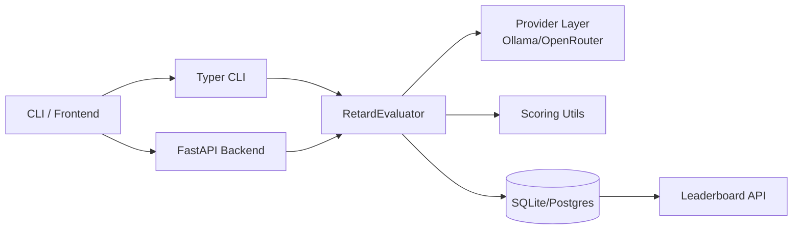

# Architecture

## Layers
- `src/core`: config, data models, exceptions
- `src/providers`: abstraction + provider implementations
- `src/evaluators`: scoring orchestrators and judge hooks
- `backend/`: FastAPI HTTP API
- `frontend/`: Next.js 15 App Router UI
